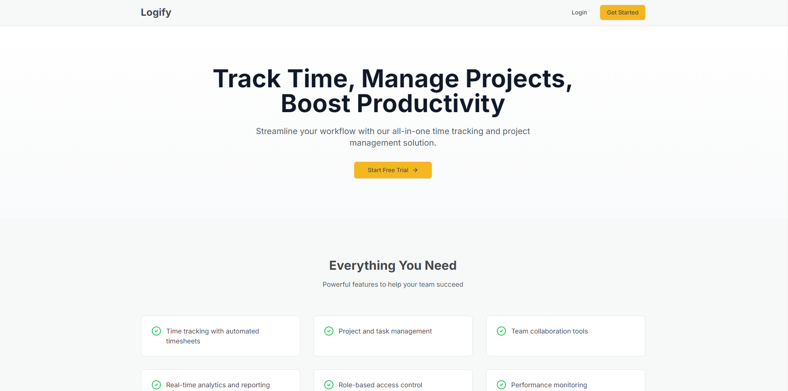
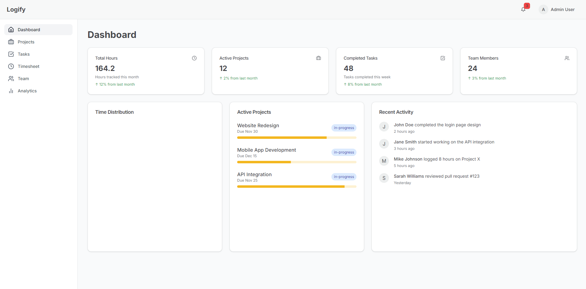
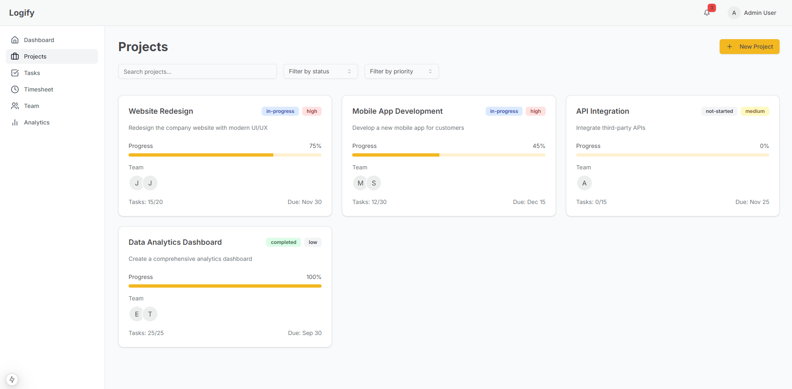
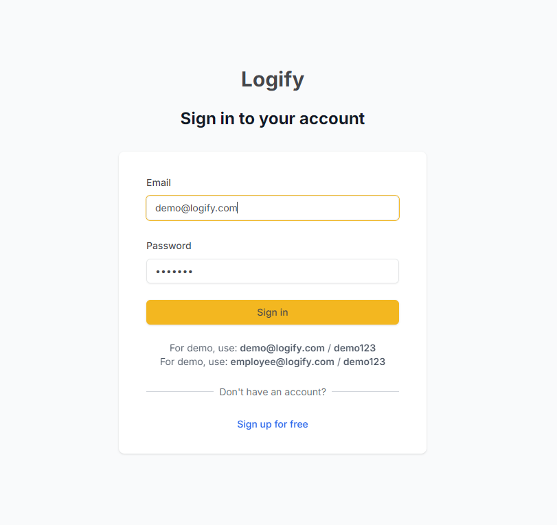

# Logify - Employee Time Tracking & Project Management



Logify is a modern, intuitive time tracking and project management solution built with Next.js and TypeScript. It helps teams streamline their workflow by combining time tracking, project management, and team collaboration into one seamless platform.

## Features

### 🎯 Core Features
- **Role-based Access Control**
  - Admin dashboard with comprehensive management capabilities
  - Employee view with restricted permissions
  - Customizable access levels

- **Project Management**
  - Project creation and tracking
  - Progress monitoring
  - Team assignment
  - Priority and status management

- **Time Tracking**
  - Automated timesheet generation
  - Weekly and monthly views
  - Time distribution analytics
  - Task-based time logging

- **Team Collaboration**
  - Real-time activity feed
  - Task assignments
  - Project updates
  - Team member status tracking

- **Analytics & Reporting**
  - Time distribution visualization
  - Project progress tracking
  - Performance metrics
  - Customizable dashboards

### 💫 User Experience
- Responsive design for all devices
- Dark/Light mode support
- Smooth animations and transitions
- Interactive data visualizations

## Technology Stack

### Frontend
- Next.js 14 (App Router)
- TypeScript
- Redux (with Redux Toolkit)
- Framer Motion
- Tailwind CSS
- shadcn/ui Components
- Chart.js / Recharts

### Backend (Planned)
- Node.js
- Express.js

## Screenshots

### Dashboard

- Overview of key metrics
- Time distribution charts
- Recent activity feed
- Project progress tracking

### Projects

- Project cards with status indicators
- Progress bars
- Team assignment visualization
- Priority markers

### Authentication

- Clean, modern login interface
- Role-based access
- Secure authentication flow

## Getting Started

### Prerequisites
```bash
Node.js 18+ (LTS recommended)
npm or yarn or pnpm
```

### Installation
1. Clone the repository
```bash
git clone https://github.com/yourusername/logify.git
```

2. Install dependencies
```bash
npm install
# or
yarn install
# or 
pnpm install
```

3. Set up environment variables
```bash
NEXTAUTH_URL=http://localhost:3000
NEXTAUTH_SECRET=your-secret-key
```

4. Run the development server
```bash
npm run dev
# or
yarn dev
# or
pnpm dev
```

### Demo Credentials
```
Admin:
- Email: demo@logify.com
- Password: demo123

Employee:
- Email: employee@logify.com
- Password: demo123
```

## Project Structure
```
src/
├── app/                 # Next.js app router pages
├── components/          # Reusable components
├── lib/                 # Utilities and configurations
│   ├── redux/          # Redux store and slices
│   └── types/          # TypeScript types
├── styles/             # Global styles
└── providers/          # Context providers
```

## Color Scheme
- Main Background: `#F5F7F8`
- Primary Color: `#FABB18`
- Text Color: `#45474B`
- Accent Colors: `#525B6B`, `#92A5A3`

## Features by Role

### Admin
- Full project management capabilities
- Team member management
- Access to all timesheets
- Analytics and reporting
- System configuration

### Employee
- View assigned projects
- Create and manage tasks
- Submit personal timesheets
- View team members
- Access basic analytics

## Contributing
Currently, this is a personal project and not open for contributions.

## License
This project is private and not licensed for public use.
